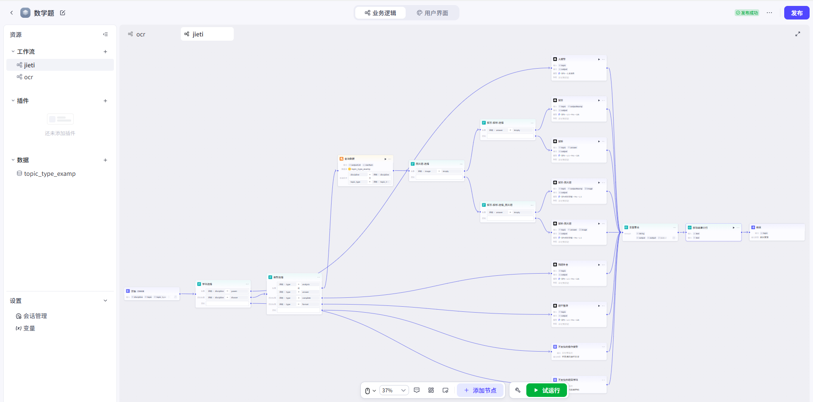

# 扣子版本 API

## 产品介绍

扣子版本 API 是基于扣子平台开发的做题 AI 助手 API 服务。该版本采用买断制，为用户提供稳定、高效的 AI 解题服务。

## 适用人群

- **企业用户**：适合需要批量处理题目、提高工作效率的企业
- **团队用户**：适合教育机构、培训机构等团队使用
- **全职人员**：适合需要长期稳定使用 AI 解题服务的个人用户
- **朋友组团**：支持多人合买，分摊成本，共享服务

## 产品优势

- **一次买断，终身使用**：无需持续订阅，一次付费即可永久使用
- **按量付费**：直接支付 AI 调用成本，费用透明
- **无限制使用**：不限制调用速度和次数
- **免费额度**：扣子平台每日提供免费 AI 调用额度，进一步降低使用成本

## 安装说明

1. 购买服务后，我们将远程协助设置扣子工作流
2. 提供为期一个月的技术支持服务
3. 确保系统正常运行和使用

## 价格方案

- **价格**：480 元（相当于一年月付价格）
- **支付方式**：一次性支付
- **服务期限**：永久使用

## 技术支持

- 购买后提供远程部署服务
- 一个月免费技术支持
- 确保系统稳定运行

## 注意事项

- 使用前需要确保有稳定的网络环境
- 建议在购买前详细了解产品功能和使用场景
- 如有任何问题，请及时联系技术支持

## 联系我们

如需购买或有任何问题，请查看[联系方式](../contact.md)。
