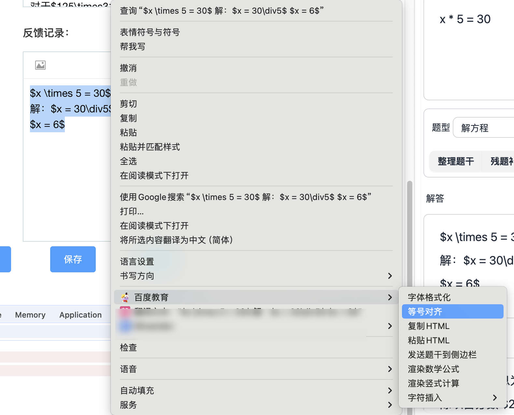

# 解方程等号对齐功能

## 功能介绍

解方程等号对齐功能可以帮助您快速整理和对齐方程组中的等号，使数学解题过程更加清晰、规范。当您在编辑解方程步骤时，此功能可以自动调整每一行的等号位置，确保它们垂直对齐，从而提高解题过程的可读性和美观度。

## 使用方法

1. 选择包含多行方程的文本（每行应包含等号）
2. 右键点击选中的文本
3. 在弹出的菜单中选择 "百度教育" > "等号对齐"

4. 系统将自动处理选中的文本，调整每行等号的位置使其垂直对齐

## 重要提示：先对齐再渲染

> **⚠️ 重要提示：** 强烈建议先使用等号对齐功能，再进行数学公式渲染。这样的工作流程可以确保最佳的排版效果。

在处理包含多行方程的文本时，请遵循以下顺序：
1. 首先输入所有方程式文本
2. 使用等号对齐功能整理文本
3. 最后应用数学公式渲染功能

这种顺序可以避免渲染后再对齐可能导致的格式问题，并确保最终呈现的数学公式既美观又规范。

## 适用场景

此功能特别适用于以下场景：

- 解方程组
- 多步骤的代数运算
- 数学证明过程
- 任何需要等号对齐的多行数学表达式

## 使用技巧

- 确保选中的文本中每行都包含等号
- 如果有多个等号，系统将对齐第一个等号
- 对齐后，您仍然可以编辑文本内容，但可能需要重新应用对齐功能
- 此功能也适用于不等号（<, >, ≤, ≥）的对齐

## 注意事项

- 选中的文本应包含完整的行，不要选择行的部分内容
- 如果文本中包含复杂的数学公式，建议先确保公式格式正确，再应用等号对齐功能
- 对齐后的文本保持原有的字体和样式设置
