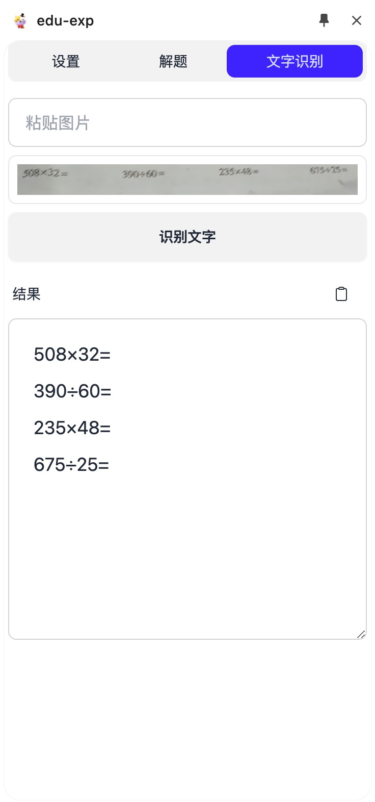

# 文字识别功能使用指南

## 功能简介
文字识别功能可以帮助您快速将图片中的文字转换为可编辑的文本格式。

## 使用步骤
1. 在左侧导航栏中点击「文字识别」标签页
2. 将需要识别的图片复制并粘贴到识别区域
3. 点击界面上的「文字识别」按钮开始识别
4. 等待几秒钟，识别结果将自动显示在文本框中

## 操作示意图

## 注意事项
- 支持的图片格式：JPG、PNG、BMP等常见图片格式
- 建议上传清晰的图片以获得最佳识别效果
- 如遇识别失败，可尝试重新上传图片
