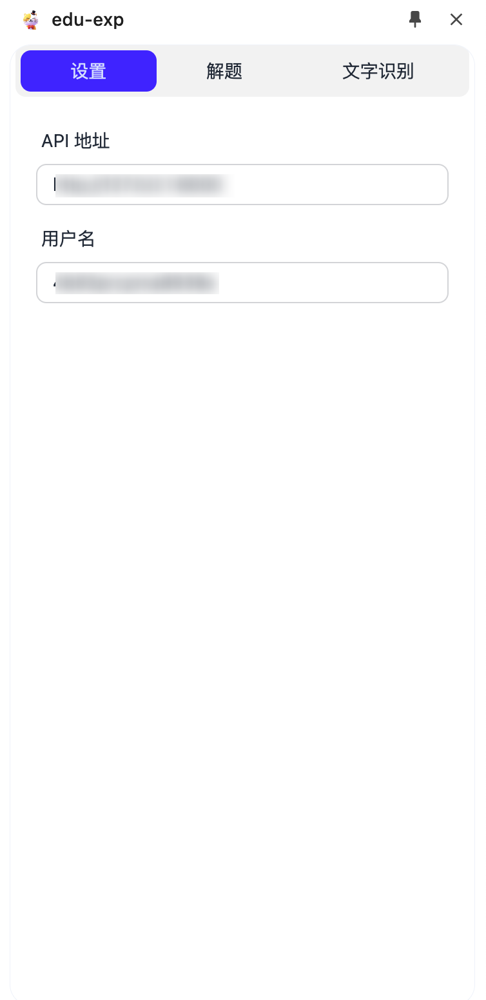

# 系统设置指南

## 基本设置步骤

1. **进入设置界面**
   - 在软件左侧导航栏中找到并点击"设置"标签
   - 系统将显示设置配置界面

2. **配置API连接**
   - 在"API地址"输入框中填入以下地址之一：
     - 主要地址：`https://bedu.pingfury.top`（推荐）
     - 备用地址：`http://47.109.61.89:5911`（当主要地址无法访问时使用）

3. **用户认证**
   - 在"用户名"输入框中填入您购买的授权用户名
   - 请确保输入的用户名准确无误，区分大小写

## 设置界面预览

下图展示了设置界面的具体位置和填写示例：

## 注意事项

- 首次配置后请点击保存按钮
- 如遇连接问题，请先尝试切换到备用地址
- 用户名若输入错误，系统将无法正常使用
