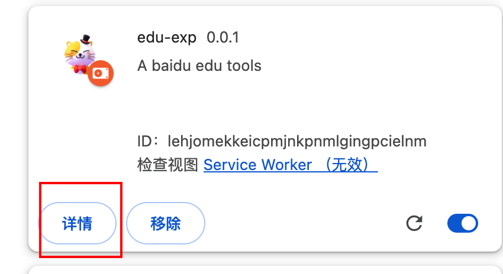
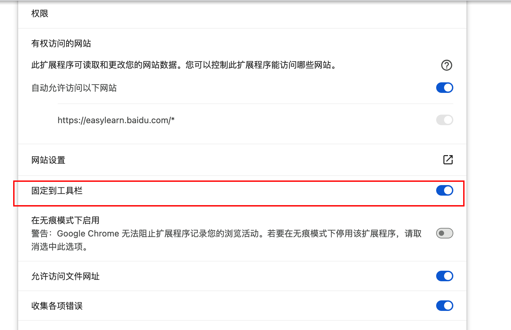
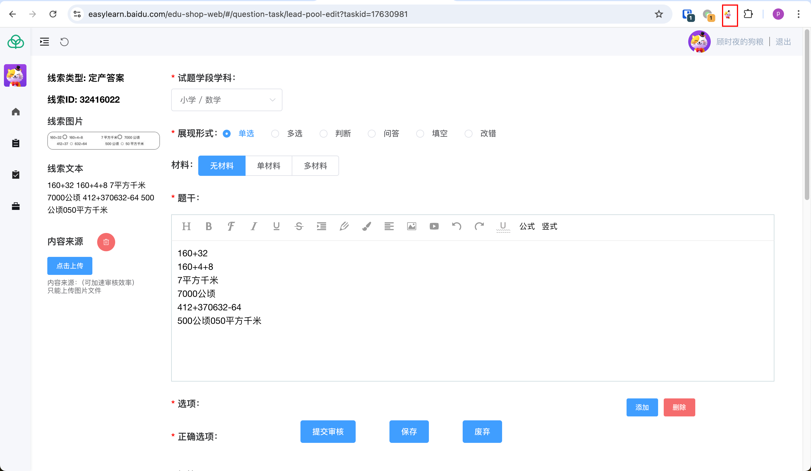
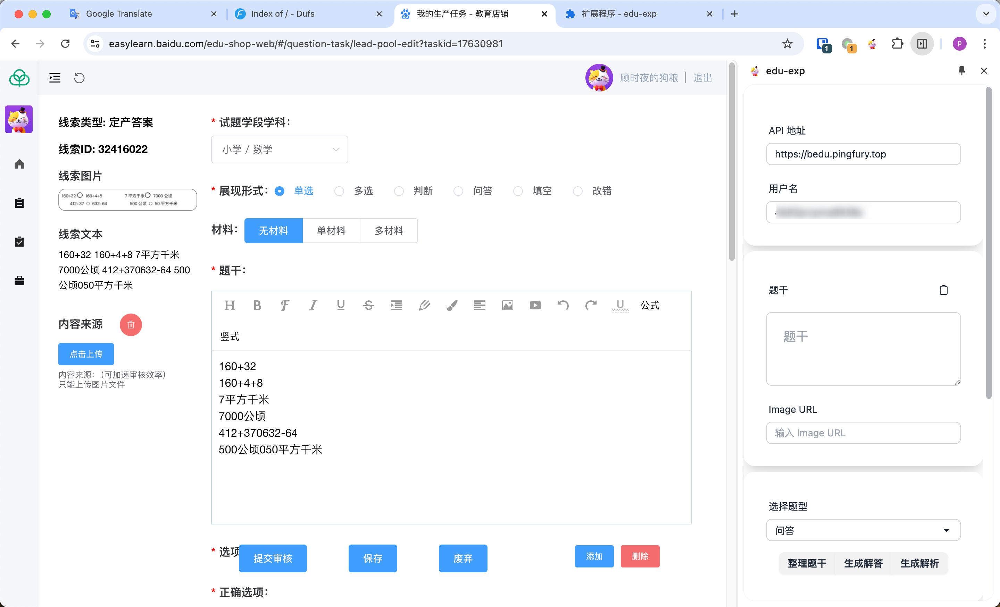

# 安装

## Chrome(谷歌浏览器)

- 下载插件离线安装包 [http://47.109.61.89:5801/edu-exp-0.1.4.zip](http://47.109.61.89:5801/edu-exp-0.1.4.zip)
- 将下载的压缩包解压到一个干净的目(目录名称不要带中文)
- 在Chrome浏览器中安装插件：
  1. 在地址栏中输入 `chrome://extensions/`（或点击浏览器右上角三点菜单 → 更多工具 → 扩展程序）
  2. 在扩展程序页面右上角打开"开发者模式"
  3. 点击左上角的"加载已解压的扩展程序"按钮
  4. 在弹出的文件选择框中，选择之前解压的插件目录
  5. 插件会被自动安装到Chrome浏览器中
- 将插件固定到侧边栏
  1. 步骤1
  
  2. 步骤二
  

- 点击工具栏图标打开侧边栏
  
  

- 安装完成

## Microsoft Edge(微软系统浏览器)

- 使用Edge 打开连接 [https://microsoftedge.microsoft.com/addons/detail/chnjahdiokpfogmnolifgopipkpijknh](https://microsoftedge.microsoft.com/addons/detail/chnjahdiokpfogmnolifgopipkpijknh)

-  点击 [获取] -> [添加扩展] -> [顶部扩展] -> [在工具栏显示]

<video width="100%" height="auto" controls>
  <source src="/img/edge_edu_exp_install.mp4" type="video/mp4">
</video>

## 其他

参考 Chrome 的安装方式
